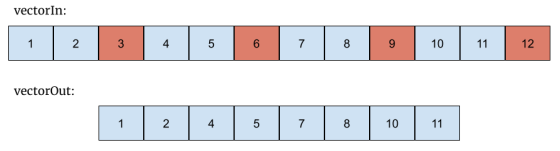

# Facultad de Ingeniería
## Universidad de Buenos Aires

### Carrera de Especialización en Sistemas Embebidos

---

## Guía Práctica 2
**Uso de instrucciones condicionales en Assembly**

### Introducción
Se pide realizar los ejercicios primero en C y luego en assembly, verificando posteriormente que el algoritmo funcione correctamente. Compare los tiempos de ejecución en ciclos de cada función y compare cuánto tarda en ejecutarse en C contra Assembly. Se recomienda que los ejercicios se hagan de manera consecutiva y que se realicen comentarios de manera prolija y ordenada. Implementar todas las funciones en un mismo archivo.

### Ejercicio 1
Realizar una función que reciba un vector de números signados de 32 bits y los “empaquete” en otro vector de 16 bits, guardando la parte alta (MSB). Utilizar el siguiente prototipo para la función:

```c
void pack32to16 (int32_t * vectorIn, int16_t *vectorOut, uint32_t longitud)
```

**Sugerencia:** utilice números mayores a 100.000 y menores a -100.000 en el vector de pruebas para poder ver los resultados.

### Ejercicio 2
Realizar una función que reciba un vector de números signados de 32 bits y devuelva la posición del máximo del vector. Utilizar el siguiente prototipo para la función:

```c
uint32_t max (int32_t * vectorIn, uint32_t longitud)
```

### Ejercicio 3
Realizar una función que reciba un vector de muestras signadas de 32 bits y descarte una de cada N muestras. Si se impone en la aplicación que longitud siempre es múltiplo de N, ¿cómo determinaría la longitud de vectorOut? Utilizar el siguiente prototipo para la función:

```c
void downSample (int32_t * vectorIn, int32_t * vectorOut, uint32_t longitud, uint32_t N)
```

**Ejemplo:** 
```c
downSample(vectorIn, vectorOut, 12, 3) // longitud = 12; N = 3
```
El resultado esperado deberá ser:



### Ejercicio 4
Realizar una función que reciba un vector de muestras no signadas de 16 bits e invierta su orden. Utilizar el siguiente prototipo para la función:

```c
void invertir (uint16_t * vector, uint32_t longitud)
```